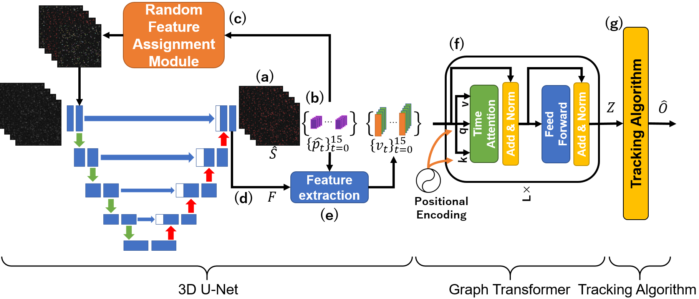

# PTGT
> **Single-Particle Tracking by Graph Transformer**
>
> Satoshi Kamiya, Taka-aki Tsunoyama, Akihiro Kusumi, Kazuhiro Hotta



## Abstract
The immune system has been studied extensively by increasing the demand for object tracking of particles. However, because researches on single-particle tracking (SPT) by machine learning have not progressed yet, currently there is a reliance on software analysis despite low accuracy. There are three problems with SPT. First, there are no differences in the feature of each molecule, so tracking by feature differences is not possible. Second, it is difficult to predict the direction of molecular motion because it is random. Third, the high density of molecules causes frequent ID switches. 
Therefore, we propose Particle Tracking via Graph Transformer (PTGT), which takes into account the relationships among molecules, to solve these problems.

## Installation
Install packages for Python 3.7:
```
git clone https://github.com/Satoshi628/PTGT.git
cd PTGT
pip install -r requirements.txt
```
Run the following code to generate a probability map of the numerator:
```
python track_to_hdf5.py
python generator_EP.py
```

You need to train 3D U-Net:
```
python main_backbone.py
```
You can change to other settings by editing `config/main_backbone.yaml`.

Train Graph Transformer:
```
python main.py
```
Similarly, you can change to other settings in Graph Transformer by editing `config/main.yaml`.

Test the Trained model:
```
python test.py
```

## Citation
*To Do*
